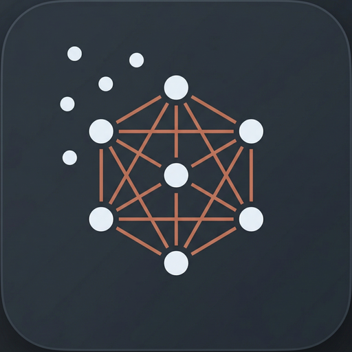

<p align="center">
  
</p>

<h1 align="center">Connecting Dots</h1>

<p align="center">
  A second brain plugged into Twitter/X.
  <br>
  Automatically organizes your bookmarks into thematic clusters using AI.
</p>

<p align="center">
  <a href="https://github.com/mathiaschebbah/connecting-dots/releases">
    
  </a>
  <a href="https://github.com/mathiaschebbah/connecting-dots/blob/main/LICENSE">
    
  </a>
</p>

---

Connecting Dots syncs your X/Twitter bookmarks and uses Claude AI to sort them into **dots** — focused topic clusters like `rust-async`, `llm-agents`, or `figma-tips`. It learns from your corrections over time, so classification keeps getting better.

## Features

- **Automatic bookmark sync** — reads your browser cookies to fetch bookmarks directly from X, no login or token to paste
- **AI-powered classification** — Claude groups bookmarks into fine-grained thematic dots with summaries and tags
- **Adaptive learning** — when you move a bookmark to a different dot, the app records the correction and adjusts future classification
- **Full-text search** — find any bookmark by content, author, or topic
- **Desktop app** — native macOS, Windows, and Linux app built with Tauri

## Requirements

- A browser (Chrome, Firefox, Edge, Brave, or Safari) logged into X/Twitter
- An [Anthropic API key](https://console.anthropic.com/)

## Download

Grab the latest installer for your platform from the [Releases](https://github.com/mathiaschebbah/connecting-dots/releases) page:

| Platform | Format |
|----------|--------|
| macOS    | `.dmg` |
| Windows  | `.exe` (NSIS installer) |
| Linux    | `.deb`, `.AppImage` |

## Development

```bash
# Prerequisites: Rust (1.77+), Node.js (18+)
git clone https://github.com/mathiaschebbah/connecting-dots.git
cd connecting-dots
npm install
npm run tauri dev
```

### Tech stack

| Layer    | Stack |
|----------|-------|
| Frontend | React, TypeScript, Tailwind CSS, Zustand |
| Backend  | Rust, Tokio, SQLite |
| AI       | Anthropic Claude API |
| Framework| Tauri 2 |

## License

[MIT](LICENSE)
